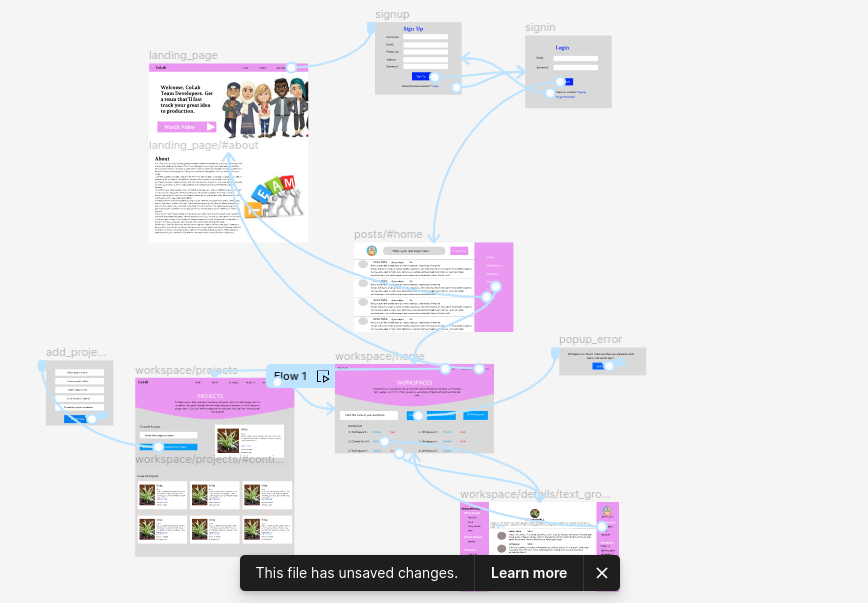
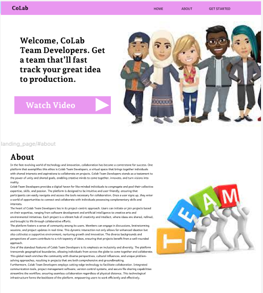
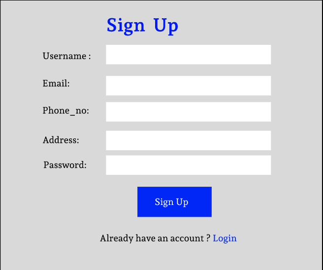
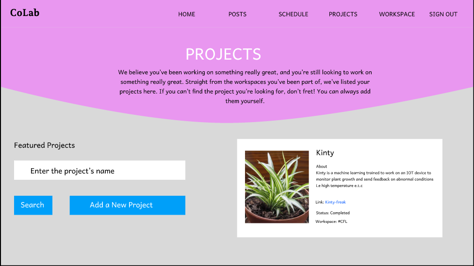
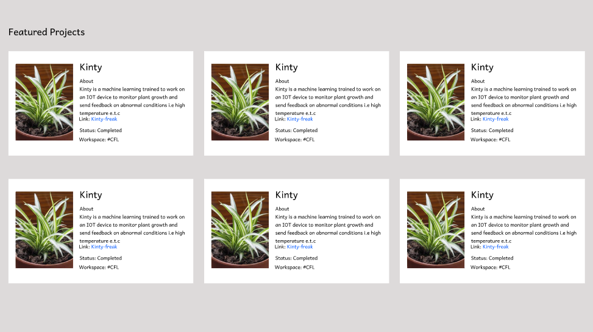
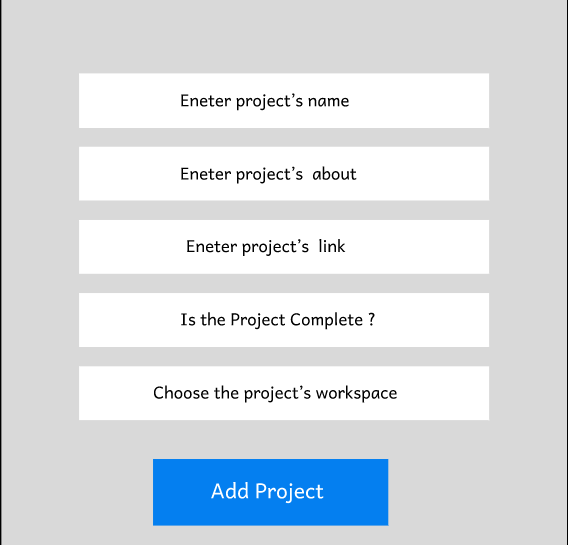
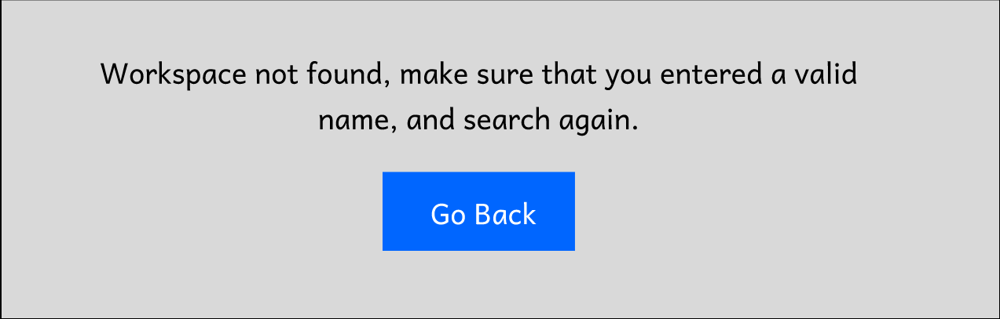
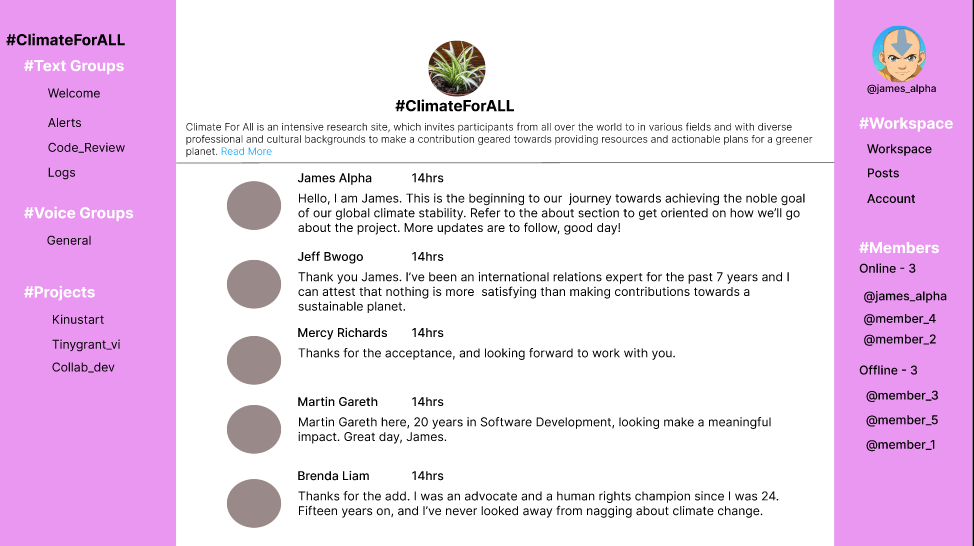

# Initial Figma design files and Prototype(Partial) 
*Note*:
- Work in progress, expect some broken links.
- We've kept our design simple, no fancy animations and no goobledycook.
 
  

# Checklist - Individual Pages Needed for the Project
1. Landing Page 
- [x] Landing page
- [x] Sign Up page
- [] Forgot Password
- [x] Login Page

2. Posts page
- [x] Posts home page
- [] Notifications
- [x] Workspace(redirects to workspace homepage)
- [] Account
- [] Others

3. Workspace - home
- [x] Workspace home page
- [x] Projects(partially done)
- [] Schedule
- [x] Posts(Redirects to posts home page)

4. Workspace - detailed
- [x] Detailed Workspace home(specific group)
- [x] Text groups
- [] Voice groups
- [] Project's links

# Page Details
1. Landing Page - This the project's landing page. It is the first user's interaction with the project.

**Landing Page**

  

**Signup Form**

  

2. Posts - User can post project's ideas here, and lookout for other people willing to takle the project with them. It's almost like a social networking application but with limited features.

3. Workspace - This is the landing page of workspaces.

**Workspace - home**

  

**Projects**

  

**Add Project Form**

  

**Search Workspace Popup Error**

  

4. Detailed Workspace - Once the user picks a project to collaborate on, he/she is given a link to a specific workspace, which contains all the details pertaining how to handle the project.

**Detailed Workspace Home**

  

**Text Groups(Welcome)**

****
# Tags and Mentions
* Frontend Development
* UI/UX
* @SiddhantTotade

# Tools
* Figma( UI design, Prototyping).

# Links
* [Prototype] (https://www.figma.com/proto/GTauawSwIXRvtrKZX1fCO0/ColabTeamDevelopers?type=design&node-id=2-2&t=cAcEXAjjuchrt5SS-1&scaling=contain&page-id=0%3A1&starting-point-node-id=28%3A182&mode=design)

